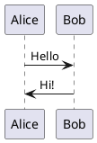

Regular **Markdown** here.

| wer | rt  | 23  | 45  | 2        |     |     |
| --- | --- | --- | --- | -------- | --- | --- |
| 34  | %4  | 65  | 45  | <ul style="display:table-row"><li style="display: table-cell;vertical-align: middle;"> [x] Done</li></ul> | 23  |
 

| wer | rt  | 23  | 45  | 2                          |     |     |
| --- | --- | --- | --- | -------------------------- | --- | --- |
| 34  | %4  | 65  | 45  | <ul><li>- [ ] df</li></ul> | 23  |     |
 

| Основной функционал                             | Описание                                                      | Состояние                     | Срок сдачи |
| ----------------------------------------------- | ------------------------------------------------------------- | ----------------------------- | ---------- |
| Организация и управление очередями в учреждении | [Описание](##Организация и управление очередями в учреждении) | <ul><li>- [ ]  Done</li></ul> |            |
|                                                 |                                                               |                               |            |
|                                                 |                                                               |                               |            |
|                                                 |                                                               |                               |            |

##Организация и управление очередями в учреждении

### System Overview

